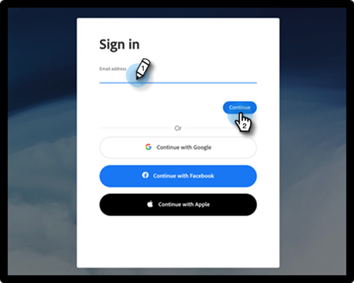

# 用户使用Adobe ID登录 {#user-sign-in-with-adobe-id}

当具有Adobe身份的用户需要登录到Marketo Engage应用程序时，他们必须通过Adobe ID登录链接登录，而不是通过Marketo登录页面上的典型登录。 单击链接后，会将用户定向到Marketo Engage应用程序。

1. 单击 **使用Adobe ID登录** 链接。

   

1. 输入Adobe凭据并单击 **继续**.

   

成功登录后，您将被定向到Marketo Engage应用程序。
