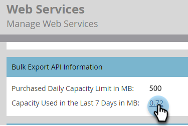

# 批量导出 API 信息 {#bulk-export-api-information}

了解如何检查您的Marketo Engage实例在过去七天内占用了多少[批量提取API](https://experienceleague.adobe.com/en/docs/marketo-developer/marketo/rest/bulk-extract/bulk-extract){target="_blank"}容量。

>[!NOTE]
>
>如果您需要更多产能，请联系您的客户代表。

1. 进入 **[!UICONTROL Admin]** 区域。

   

1. 单击 **[!UICONTROL Web Services]**。

   

1. 向下滚动到“批量导出API信息”卡片。 单击“最近7天”旁边的数字，以查看每日/API用户的使用情况。

   

   

>[!NOTE]
>
>您的Marketo Engage实例的分配每天于中部标准时间凌晨12:00重置。
