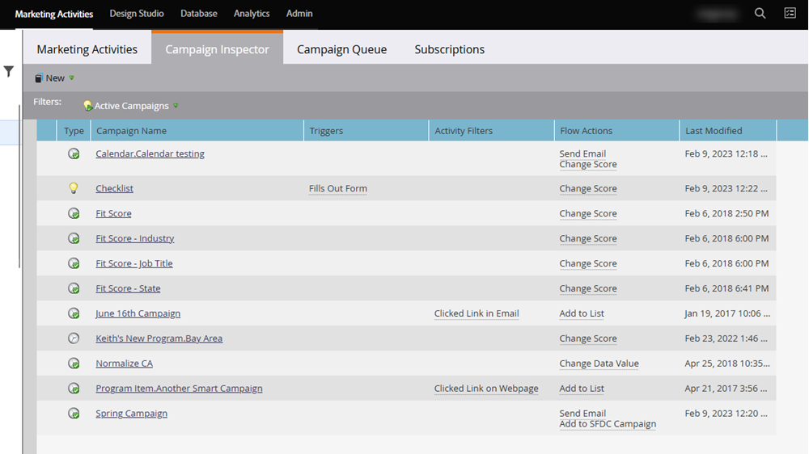

# 营销活动检查器 {#campaign-inspector}

使用营销活动检查器在一个位置查看和搜索所有Smart营销活动。

## 启用活动检查器 {#enable-campaign-inspector}

1. 进入 **[!UICONTROL Admin]** 区域。

   

1. 单击 **[!UICONTROL Treasure Chest]**。

   

1. 单击营销活动检查器旁边的&#x200B;**[!UICONTROL Edit]**。

   

1. 选中&#x200B;**[!UICONTROL Enabled]**&#x200B;复选框并单击&#x200B;**[!UICONTROL Save]**。

   

   >[!NOTE]
   >
   >需要在树中选择所需的工作区，以便在启用活动检查器选项卡后查看该选项卡。

## 使用活动检查器 {#using-campaign-inspector}

启用后，营销活动检查器选项卡将位于营销活动选项卡旁边。

单击&#x200B;**[!UICONTROL Active Campaigns]**&#x200B;下拉列表以按不同类型的营销活动进行筛选。

在页面底部，访问有用的工具，如搜索栏或导出结果。

