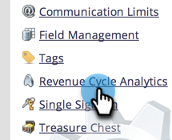

# 更改分析的归因设置 {#change-attribution-settings-for-analytics}

您可以更改Marketo将联系人与首次联系和多次联系归因机会、商机转化量度以及受营销影响的商机标志关联的方式。

1. 进入 **[!UICONTROL Admin]** 区域。

   

1. 单击 **[!UICONTROL Revenue Cycle Analytics]**。

   

1. 单击&#x200B;**[!UICONTROL Attribution]**&#x200B;下的&#x200B;**[!UICONTROL Edit]**&#x200B;链接。

   

   >[!TIP]
   >
   >更改此设置不会修改任何Marketo数据，而是会更改报表的运行方式。 可以随时撤消此操作。

1. 选择一个选项，然后单击&#x200B;**[!UICONTROL Save]**。

   

   >[!NOTE]
   >
   >**定义**
   >
   >**[!UICONTROL Explicit]**：仅具有角色的联系人（默认）。
   >
   >**[!UICONTROL Hybrid]**：具有角色的联系人（如果可用）。 如果没有可用联系人，则它会使用帐户中的所有联系人。
   >
   >**[!UICONTROL Implicit]**：所有联系人，不考虑角色。

>[!CAUTION]
>
>使用&#x200B;**[!UICONTROL Implicit]**&#x200B;时，Marketo将始终检查与该帐户关联的所有联系人，不论角色如何。 **Marketo强烈建议使用[!UICONTROL Explicit]模式**。 使用[!UICONTROL Implicit]可能会产生误报；即，尽管对机会没有实际影响，但拥有机会信用的人员。 请谨慎使用[!UICONTROL Implicit]。
