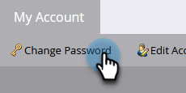

# 更改您的 Marketo 密码 {#change-your-marketo-password}

可通过这些简单的步骤更改您的Marketo密码。

1. 进入 **[!UICONTROL Admin]** 区域。

   

1. 单击 **[!UICONTROL My Account]**。

   

1. 单击 **[!UICONTROL Change Password]**。

   

1. 输入旧密码和新密码，然后单击&#x200B;**[!UICONTROL Save]**。

   

   >[!NOTE]
   >
   >进行更新时，请注意密码要求。
