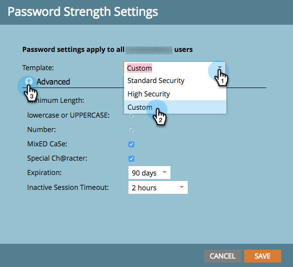

# 更改密码安全设置 {#change-your-password-security-settings}

控制订阅的密码策略。 具体方法如下。

>[!NOTE]
>
>**需要管理员权限**

1. 转到 **[!UICONTROL 管理员]** 区域。

   

1. 单击 **[!UICONTROL 登录设置]**.

   

1. 下 **[!UICONTROL 安全设置]**，单击 **[!UICONTROL 编辑]**.

   

1. 选择 **[!UICONTROL 模板]**. 对于高级选项，单击 **[!UICONTROL 高级]** 下拉菜单。

   

   >[!NOTE]
   >
   >模板只是预建配置。 标准是好的。 高安全性是最强的。 自定义可让您创建自己的项目。

   >[!TIP]
   >
   >在 **[!UICONTROL 自定义]**，请勾选方框以指示您希望用户在创建密码时包含哪些特征。

1. 设置 **[!UICONTROL 过期]**. 此功能自动要求用户在一定时间后重置密码。 这包括管理员用户。

   

   >[!CAUTION]
   >
   >现有用户不会收到更改的通知。 设置 **[!UICONTROL 过期]** 第一天为30天，以确保每个人都已更新到新设置，然后将此设置更改回您的原始节奏。

1. 设置 **[!UICONTROL 非活动会话超时]**. 此值确定用户在必须重新登录Marketo之前可以处于非活动状态的时长。

   
