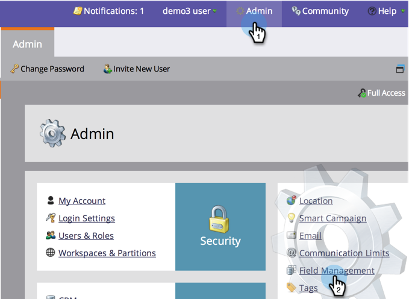
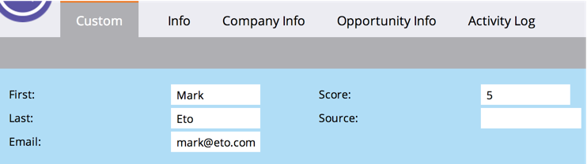

# 为“人员详细信息”页面{#creating-a-custom-tab-for-the-person-detail-page}创建自定义选项卡

如果您发现自己一次又一次地在人物详细信息中寻找一组特定字段，请考虑创建自定义布局以简化工作。

1. 转至&#x200B;**Admin**&#x200B;并单击&#x200B;**字段管理**。

   

1. 单击&#x200B;**自定义布局设计器**&#x200B;选项卡。

   

1. 查找要添加的字段，然后将其拖放到画布中。

   

1. 继续添加字段，直到布局达到所需的效果。

   

   >[!NOTE]
   >
   >您有两列可处理。

   如果您决定要删除字段，请右键单击要删除的字段，然后单击&#x200B;**删除**。

   

   太棒了！ 现在，在加载人员详细信息时，您可以使用自定义布局访问对您重要的信息。

   
