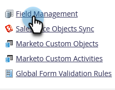

# 为“人员详细信息”页面创建自定义选项卡 {#creating-a-custom-tab-for-the-person-detail-page}

如果您发现自己一次又一次地在人员详细信息中查找一组特定字段，请考虑创建自定义布局以简化操作。

1. 转到 **管理员** 的上界。

   

1. 单击 **字段管理**.

   

1. 单击 **自定义布局设计器** 选项卡。

   

1. 查找要添加的字段，然后将其拖放到画布中。

   

1. 继续添加字段，直到您按所需方式布局为止。

   

   >[!NOTE]
   >
   >您有两列要处理。

   如果您决定要删除某个字段，请右键单击要删除的字段，然后单击 **删除**.

   

   太棒了！ 现在，当您加载人员的详细信息时，可以使用自定义布局访问对您重要的信息。

   
