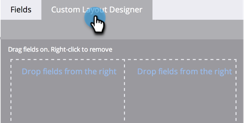

# 创建人员详细信息页面的自定义选项卡 {#creating-a-custom-tab-for-the-person-detail-page}

如果您发现自己需要在人员详细信息中反复查找一组特定的字段，请考虑创建自定义布局以简化操作。

1. 转到 **[!UICONTROL 管理员]** 区域。

   

1. 单击 **[!UICONTROL 字段管理]**.

   

1. 单击 **[!UICONTROL 自定义布局设计器]** 选项卡。

   

1. 查找要添加的一个字段，然后将其拖放到画布中。

   

1. 继续添加字段，直到获得所需的布局。

   

   >[!NOTE]
   >
   >您有两列要处理。

   如果决定要删除字段，请右键单击要删除的字段，然后单击 **[!UICONTROL 删除]**.

   

   做得很棒！ 现在，当您加载人员详细信息时，可以使用自定义布局访问对您而言非常重要的信息。

   
