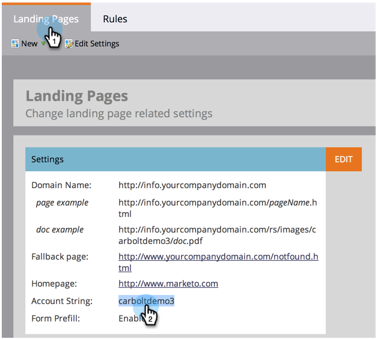
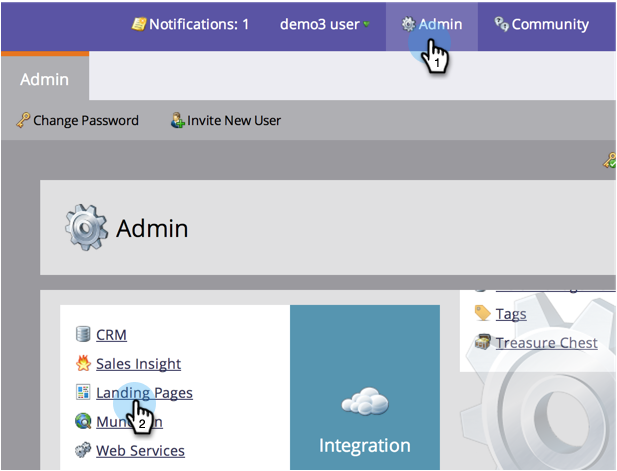

# 使用CNAME（管理）自定义登陆页面URL {#customize-your-landing-page-urls-with-a-cname-administration}

即使Marketo托管您的登陆页面，也应为您的公司自定义URL。

>[!NOTE]
>
>无CNAME:
>
>https://na-sj02.marketo.com/lp/mktodemoaccount126/UnsubscribePage.html
>
>品牌CNAME:
>
>https://go。**YourCompany**.com/UnsuscribePage.html

>[!NOTE]
>
>**需要管理员权限**

让我们帮你设置！

1. 选择CNAME。

   它是URL的前部。 示例:

   * **go**.YourCompany.com/NameOfPage.html
   * **信息**.YourCompany.com/NameOfPage.html
   * **页面**.YourCompany.com/NameOfPage.html

   一个词（加上YourCompany.com）叫做CNAME。 您稍后需要此功能，请记下此功能。

1. 查找帐户字符串。

1. 转到 **管理员** 单击 **登陆页面**.

   

1. 在 **登陆页面** ，请从“设置”部分复制帐户字符串。

   

1. 您以后还需要此插件，请记下此插件。

1. 向IT发送请求。

1. 请您的IT员工设置以下CNAME(替换 [CNAME] 和 [帐户字符串] （使用上一步中的文本）：

   [CNAME].YourCompany.com > [帐户字符串].mktoweb.com

1. 完成CNAME设置。

1. IT部门创建CNAME后，转到 **管理员** 单击 **登陆页面**.

   

1. 在 **设置** ，单击 **编辑**.

   

1. 在 **登陆页面的域名**，输入 **回退页面**，输入 **主页**，然后单击 **保存**.

   

您的后备页面是指当您的Marketo登陆页面不可用时，用户将被重定向的页面。

干得好！ 登陆页面现在使用您的公司域进行标记。
