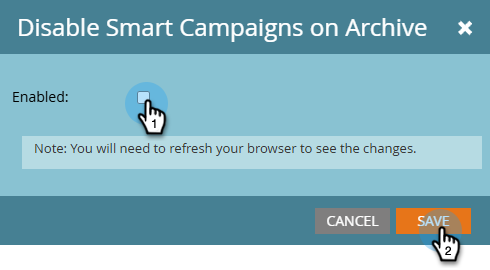

# 在存档上禁用智能营销活动 {#disable-smart-campaigns-on-archive}

启用此功能后，存档文件夹或项目将自动停用其营销活动以防止意外活动。

存档文件夹或项目群，或将活动的智能营销活动移动到已存档的文件夹中时，Marketo Engage会停止运行受影响的营销活动：

* **触发的营销活动**&#x200B;已停用。
* **批次营销活动**&#x200B;已取消其挂起的运行。
* **可执行营销活动**&#x200B;没有运行状态，因此不执行任何操作。

## 如何启用 {#how-to-enable}

1. 在&#x200B;**管理员**&#x200B;部分中，单击&#x200B;**Treasure Chest**。

   

1. 滚动到&#x200B;_在存档上禁用Smart Campaigns_，然后单击&#x200B;**编辑**。

   

1. 选中&#x200B;**已启用**&#x200B;复选框，然后单击&#x200B;**保存**。

   

<table>
  <tr>
    <td><b>已启用（已选中）</b></td>
    <td>根据上述规则，存档可取消激活每个营销活动。</td>
  </tr>
  <tr>
    <td><b>已禁用（未选中）</b></td>
    <td>存档文件夹或项目群仍然有效，但营销活动保持运行或按原样计划。</td>
  </tr>
</table>

>[!IMPORTANT]
>
>切换此设置后，必须刷新浏览器才能使更改生效。

## 支持的操作

启用&#x200B;_在存档上禁用智能营销活动_&#x200B;后，以下操作会停用营销活动：

* 将包含活动营销活动的&#x200B;**文件夹**&#x200B;拖放到已存档的文件夹中
* 将包含活动营销活动的&#x200B;**项目**（任何类型）拖放到存档文件夹中
* 将&#x200B;**单个智能营销活动**&#x200B;拖放到已存档文件夹中
* 在单个智能营销活动上右键单击&#x200B;**将**&#x200B;移动到已存档文件夹中
* 在包含活动营销活动的文件夹上右键单击&#x200B;**将文件夹**&#x200B;移动到已存档文件夹中
* 在包含活动营销活动的项目上右键单击&#x200B;**将**&#x200B;移动到已存档文件夹中
* 在文件夹上右键单击&#x200B;**转换为已存档文件夹**&#x200B;以将其存档到适当位置而不移动它

>[!NOTE]
>
>如果在其他位置（例如，通过“请求营销活动”流程步骤）引用了要存档的文件夹或项目中的某个智能营销活动，则会阻止存档，以防止破坏该其他营销活动。
