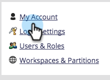

# 编辑帐户设置 {#edit-account-settings}

需要更改帐户电子邮件地址、姓名或电话号码？ 了解以下内容。

>[!NOTE]
>
>**需要管理员权限**

1. 转到 **[!UICONTROL 管理员]** 区域。

   

1. 选择 **[!UICONTROL 我的帐户]**.

   

1. 选择 **[!UICONTROL 编辑帐户设置]**.

   

1. 进行编辑并单击 **[!UICONTROL 保存]**.

   
