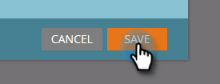

# 编辑登陆页面设置 {#edit-landing-page-settings}

您可以编辑域名和备用页面，启用或禁用表单预填充，防止滥用登陆页面等。 具体方法如下。

>[!NOTE]
>
>**需要管理员权限**

1. 转到 **[!UICONTROL 管理员]** 区域。

   

1. 单击 **[!UICONTROL 登陆页面]**.

   

1. 在 **[!UICONTROL 登陆页面]** 部分，单击 **[!UICONTROL 编辑]**.

   

1. 输入您的域和页面信息。

   

   | 术语 | 条件 |
   |---|---|
   | [!UICONTROL 登陆页面的域名] | 这是您的CNAME。 CNAME是您为登陆页面授予用户的URL的第一部分。 例如，在 `https://go.yourCompany.com`，单词“go”就是CNAME。 您可以有多个，但大多数人只使用一个。 |
   | [!UICONTROL 回退页] | 如果登陆页面不存在或关闭，则前往此位置。 了解有关 [回退页面](/help/marketo/product-docs/administration/settings/set-a-fallback-page.md). |
   | [!UICONTROL 主页] | 输入您的公司网站URL。 |

1. 查看 **[!UICONTROL 表单预填]** 此复选框允许表单预填充已知（已编码）人员的信息。 取消选中以阻止。

   

   >[!NOTE]
   >
   >如果您想要预填充 `<script>` 标签的后面 `<head>` 标记时，请检查 **[!UICONTROL 在标题末尾插入预填充脚本]** 盒子。 如果您希望它显示在开头，请将其保留为取消选中状态。
   >
   >Check **[!UICONTROL 删除默认的favicon链接]** 以防止Marketo在代码中插入任何favicon链接。

1. 进行选择后，单击 **[!UICONTROL 保存]**.

   

   做得好！您的登陆页面现在拥有正确的信息，应该立即开始工作。
