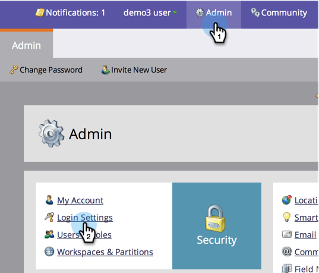

# 在报表和警报中编辑链接到期 {#edit-link-expiration-in-reports-and-alerts}

报表订阅电子邮件中的链接会在三天后过期。 要更改这些链接的过期时间，请执行以下步骤。

>[!NOTE]
>
>**需要管理员权限**

1. 在 **管理员**，单击 **登录设置**.

   

1. 单击 **编辑URL过期**.

   

1. 在下拉列表中，选择链接过期的天数。 单击 **保存**.

   

>[!IMPORTANT]
>
>此设置仅适用于报表和警报中的链接。 确实如此 **not** 申请电子邮件 [下载报告](/help/marketo/product-docs/reporting/basic-reporting/report-subscriptions/subscribe-to-a-smart-list.md#email-message) 链接或营销电子邮件。
