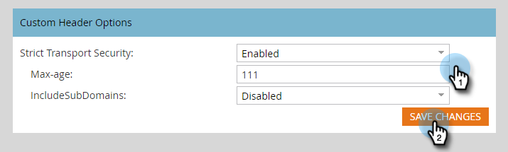

# 电子邮件跟踪链接标头 {#email-tracking-link-headers}

请按照以下步骤自定义您的电子邮件跟踪链接标头。

1. 在Marketo中，单击&#x200B;**[!UICONTROL Admin]**。

   

1. 单击 **[!UICONTROL Email]**。

   

1. 向下滚动到“自定义标题选项”。 选择所需的设置，然后单击&#x200B;**[!UICONTROL Save Changes]**。

   

<table>
 <tr>
  <td><strong>严格传输安全</strong></td>
  <td>使用此项可保证跟踪链接始终通过HTTPS提供（只应为具有SSL保护的跟踪链接的订阅设置）</td>
 </tr>
</table>

>[!CAUTION]
>
>务必与IT团队一起查看这些设置，以确定贵组织的策略应设置为什么内容。 不正确的设置可能会阻止某些访客访问您的电子邮件链接。
