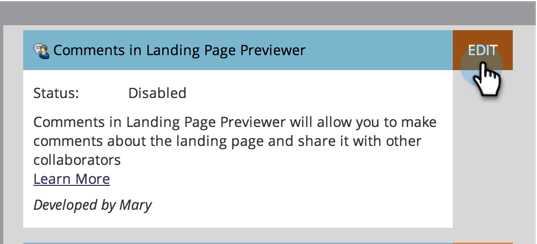

# 启用或禁用金库功能 {#enable-or-disable-treasure-chest-features}

“金银箱”有一些有趣的实验功能，但这些功能并不完全受支持。

>[!NOTE]
>
>**需要管理员权限**

1. 在 **管理员** 单击 **宝箱**.

   

1. 单击 **编辑** 对于要启用或禁用的功能。

   

1. 检查 **已启用** 复选框启用，或取消选中禁用，然后单击 **保存**.

   

   >[!TIP]
   >
   >您可能需要先注销，然后再返回Marketo，才能看到更改生效。
