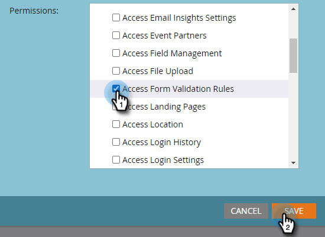
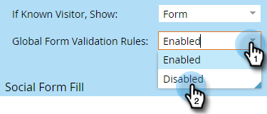

# 全局表单验证规则 {#global-form-validation-rules}

此功能允许您阻止特定域提交到Marketo Engage表单。

## 如何启用访问 {#how-to-enable-access}

在您可以使用此功能之前，必须为每个所需角色启用其权限。

1. 在Marketo中，单击&#x200B;**[!UICONTROL Admin]**。

   

1. 单击 **[!UICONTROL Users & Roles]**。

   

1. 单击&#x200B;**[!UICONTROL Roles]**&#x200B;选项卡。

   

1. 双击要向其授予权限的角色。

   

1. 单击&#x200B;**访问管理员**&#x200B;旁边的&#x200B;**+**&#x200B;号。

   

1. 向下滚动并选择&#x200B;**[!UICONTROL Access Form Validation Rules]**&#x200B;并单击&#x200B;**[!UICONTROL Save]**。

   

## 创建新表单验证规则 {#create-new-form-validation-rule}

>[!IMPORTANT]
>
>这些规则将适用于Marketo Engage订阅中的所有表单。

1. 在Marketo中，单击&#x200B;**[!UICONTROL Admin]**。

   

1. 单击 **[!UICONTROL Global Form Validation Rule]**。

   

1. 单击 **[!UICONTROL New Form Validation Rule]**。

   

   >[!NOTE]
   >
   >[!UICONTROL Form Validation Rule Actions]下拉列表允许您删除或编辑现有规则。

1. 命名规则，为其提供可选描述，然后输入您希望表单访客看到的错误消息。 在规则框中输入要阻止的域，选择&#x200B;**[!UICONTROL Activate Rule]**，然后单击&#x200B;**[!UICONTROL Create]**。

   

>[!NOTE]
>
>Marketo Engage定义了免费消费者电子邮件域的阻止列表 列入阻止列表，在使用我们预加载的“消费者电子邮件域”规则时，将阻止这些域。 [在此查看该列表](/help/marketo/product-docs/administration/settings/assets/freemaildomains.csv)（要下载，请确保您的浏览器是最新的，可以接受下载）。

## 如何禁用每个表单的访问权限{#how-to-disable-access-per-form}

启用后，规则将应用于所有表单。 但是，如果您有一个具有特定要求的表单，并且您不希望任何内容被拒绝，则可以在表单的设置中禁用[!UICONTROL Global Form Validation Rules]。

1. 在所需表单中，单击&#x200B;**[!UICONTROL Form Settings]**，然后单击&#x200B;**[!UICONTROL Settings]**。

   

1. 单击&#x200B;**[!UICONTROL Global Form Validation Rules]**&#x200B;下拉菜单并选择&#x200B;**[!UICONTROL Disabled]**。

   

当您批准并发布表单时，它将忽略您的[!UICONTROL Global Form Validation Rules]。
