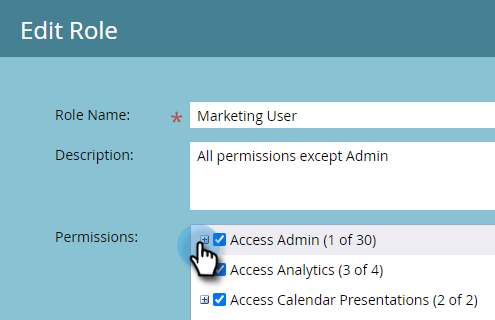

# 全局表单验证规则 {#global-form-validation-rules}

此功能允许您阻止特定域提交到Marketo Engage表单。

## 如何启用访问 {#how-to-enable-access}

在可以使用此功能之前，必须按所需角色启用其权限。

1. 在Marketo中，单击 **[!UICONTROL 管理员]**.

   

1. 单击 **[!UICONTROL 用户和角色]**.

   

1. 单击 **[!UICONTROL 角色]** 选项卡。

   

1. 双击要向其授予权限的角色。

   

1. 单击 **+** 登录访问管理员旁边。

   

1. 向下滚动并选择 **[!UICONTROL 访问表单验证规则]** 并单击 **[!UICONTROL 保存]**.

   

## 创建新表单验证规则 {#create-new-form-validation-rule}

>[!IMPORTANT]
>
>这些规则将应用于您的Marketo Engage订阅中的所有表单。

1. 在Marketo中，单击 **[!UICONTROL 管理员]**.

   

1. 单击 **[!UICONTROL 全局表单验证规则]**.

   

1. 单击 **[!UICONTROL 新建表单验证规则]**.

   

   >[!NOTE]
   >
   >表单验证规则操作下拉列表允许您删除或编辑现有规则。

1. 命名规则，为其提供可选描述，然后输入您希望表单访客看到的错误消息。 在规则框中输入要阻止的域，然后选择 **[!UICONTROL 激活规则]**，然后单击 **[!UICONTROL 创建]**.

   

>[!NOTE]
>
>Marketo Engage定义了免费消费者电子邮件域的阻止列表 阻止列表，在使用我们预加载的“消费者电子邮件域”规则时，将阻止这些域。 [在此处查看该列表](/help/marketo/product-docs/administration/settings/assets/freemaildomains.csv).

## 如何禁用每个表单的访问权限{#how-to-disable-access-per-form}

启用后，规则将应用于所有表单。 但是，如果您有一个具有特定要求的表单，并且您不希望任何内容被拒绝，则可以禁用 [!UICONTROL 全局表单验证规则] 在表单设置中。

1. 在所需的表单中，单击 **[!UICONTROL 表单设置]**，则 **[!UICONTROL 设置]**.

   

1. 单击 **[!UICONTROL 全局表单验证规则]** 下拉菜单并选择 **[!UICONTROL 已禁用]**.

   

批准并发布表单时，将忽略您的 [!UICONTROL 全局表单验证规则].
