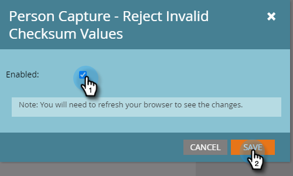

# 如何阻止垃圾邮件提交{#how-to-block-spam-form-submissions}

通常，具有无效或缺失校验和（通常来自机器人程序）的表单提交会生成虚假统计信息。 下面介绍如何防止这种情况发生。

>[!CAUTION]
>
>此功能拒绝使用程序化POST向leadCapture/save2端点提交的表单。 如果您的企业利用使用该方法向Marketo提交表单的集成，启用此功能将阻止这些提交。 不支持也禁止使用leadCapture/save2作为API或直接执行程序化表单提交。 请确保您的企业仅使用以下方式提交表单：表单资源、嵌入表单代码、Forms2.js API或提交表单REST API。

1. 单击&#x200B;**管理员**。

   

1. 单击&#x200B;**“Treasure Chest**”。

   

1. 在“**人员捕获 — 拒绝无效校验和值**”旁边，单击“编辑&#x200B;**”。**

   

1. 选中&#x200B;**已启用**&#x200B;复选框，然后单击&#x200B;**保存**。

   

>[!NOTE]
>
>启用此功能后，您可能会看到表单活动中的一个删除，因为将过滤掉假数。
