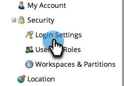

# 根据 IP 限制 Marketo 登录 {#restrict-marketo-logins-based-on-ip}

您可以根据用户的IP地址限制或允许用户访问Marketo。 操作方法如下：

>[!NOTE]
>
>**需要管理员权限**

>[!IMPORTANT]
>
>Adobe Admin Console (AAC)支持[基于IP的访问控制](https://helpx.adobe.com/enterprise/using/ip-based-access.html){target="_blank"}。 为确保顺利过渡，现有Marketo Engage IP限制将激活，包括已启用2027年第1季度此功能的Adobe ID用户订阅。
>
>* 您可以随时配置基于IP的AAC访问。
>* AAC和Marketo Engage限制可以同时运行。 使用相同的IP允许列表实现兼容性。
>
>2027年第1季度后，Marketo Engage IP限制将撤销。 基于IP的访问将专门通过AAC进行管理，并且必须配置为强制实施登录限制。 最终过渡日期将在稍后公布。

1. 进入 **[!UICONTROL Admin]** 区域。

   

1. 单击 **[!UICONTROL Login Settings]**。

   

1. 单击 **[!UICONTROL Edit IP Restrictions]**。

   

1. 选择您要&#x200B;**允许**&#x200B;还是&#x200B;**阻止**&#x200B;特定地址，请输入地址，然后单击&#x200B;**[!UICONTROL Save]**。

   >[!NOTE]
   >
   >**定义**
   >
   >* **[!UICONTROL Allowed IP addresses]**：添加允许的IP地址具有包含性。 它将包含指定的所有IP地址，并排除其他所有地址。
   >* **[!UICONTROL Block IP addresses]**：阻止特定IP访问Marketo。
   >* **[!UICONTROL Disable IP Restrictions]**：选中此项将停止任何/所有限制规则的工作。 将其用于测试目的。

   >[!NOTE]
   >
   >您可以添加多个限制，但只能全部允许或全部阻止。 不能混合和匹配允许和阻止。

   
