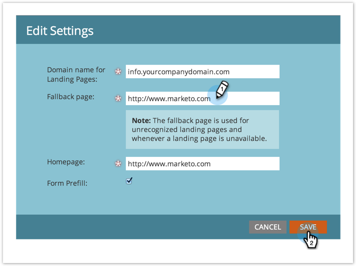

# 设置回退页面 {#set-a-fallback-page}

回退页面是登陆页面处于脱机状态或未找到的最后一道防线。 确保您已设置一个。

>[!NOTE]
>
>**需要管理员权限**

1. 进入 **[!UICONTROL Admin]** 区域。

   

1. 单击 **[!UICONTROL Landing Pages]**。

   

1. 在&#x200B;**[!UICONTROL Landing Pages]**&#x200B;选项卡下，单击&#x200B;**[!UICONTROL Edit]**。

   

1. 在对话框中输入&#x200B;**[!UICONTROL Fallback page]**&#x200B;并单击&#x200B;**[!UICONTROL Save]**。

   
