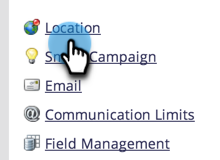

# 设置默认货币 {#set-default-currency}

了解如何查看和编辑Marketo Engage订阅的默认货币。

>[!NOTE]
>
>**需要管理员权限。**

1. 进入 **[!UICONTROL Admin]** 区域。

   

1. 单击 **[!UICONTROL Location]**。

   

1. 在[!UICONTROL Subscription Currency Settings]中单击&#x200B;**[!UICONTROL Edit]**。

   

1. 选择您选择的货币格式并单击&#x200B;**[!UICONTROL Save]**。

   
