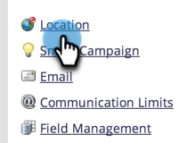

# 设置订阅的默认位置设置 {#set-default-location-settings-for-a-subscription}

本文介绍了管理员如何查看和编辑订阅的默认位置设置，包括语言、区域设置和时区。

>[!NOTE]
>
>需要管理员权限。 该语言通常不是管理员会更改的内容。 它是在购买时指定的，这样就可以以相应的语言生成订阅。

## 设置订阅的默认位置设置 {#set-default-location-settings-for-a-subscription-1}

当管理员更改默认位置设置时，新创建的用户将继承这些设置。 用户始终可以 [更改语言、区域设置和时区首选项](/help/marketo/product-docs/administration/settings/select-your-language-locale-and-time-zone.md) 在他们的个人账户里。

1. 转到 **[!UICONTROL 管理员]** 区域。

   

1. 单击 **[!UICONTROL 位置]**.

   

1. 单击 **[!UICONTROL 编辑]**.

   

   此订阅使用英语创建。 假设您位于伦敦，希望更改默认区域设置和时区。 区域设置决定了数字、日期和时间的格式。

1. 选择 **[!UICONTROL 区域设置]** 并将其更改为 **[!UICONTROL 英语（英国）]**.

   

1. 最后，选择合适的 **[!UICONTROL 时区]**.

   

   >[!NOTE]
   >
   >Marketo销售分析 [Salesforce.com](https://salesforce.com/) 支持法语、德语、日语、葡萄牙语和西班牙语。

## 设置订阅的默认货币设置 {#set-the-default-currency-settings-for-a-subscription}

如果要更改用户的默认区域设置，则可能还需要更改货币格式设置。

1. 单击 **[!UICONTROL 编辑]** 在 [!UICONTROL 订阅货币设置].

   

1. 选择您选择的货币格式并单击 **[!UICONTROL 保存]**.

   

   恭喜！您已更改订阅的位置设置。

>[!MORELIKETHIS]
>
>* [选择语言、区域设置和时区](/help/marketo/product-docs/administration/settings/select-your-language-locale-and-time-zone.md)
