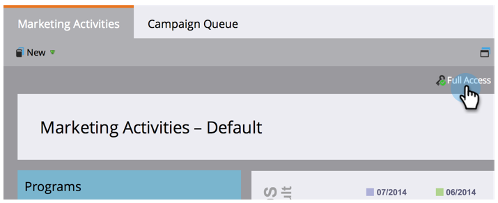

# 了解您拥有的{#find-out-what-permissions-you-have}权限

如果您想知道您在Marketo中拥有或没有哪些权限，有一种简单的方法可供您了解。

1. 转至&#x200B;**营销活动**。

   

1. 单击&#x200B;**完全访问**&#x200B;以查看您拥有的权限。

   

您将看到列出的权限。

如果您需要为您启用的任何权限，请与您的Marketo管理员联系。
