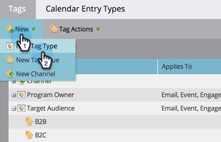

# 创建新的项目标记和标记值 {#create-a-new-program-tag-and-tag-values}

>[!NOTE]
>
>**需要管理员权限**

您可以创建自定义 [标记](/help/marketo/product-docs/core-marketo-concepts/programs/working-with-programs/understanding-tags.md) 并为标记分配值。

>[!NOTE]
>
>**示例**
>
>项目标记： Target受众
>
>计划标记值：中小型企业、企业、中端市场

1. 转到 **[!UICONTROL 管理员]** 区域。

   

1. 单击 **[!UICONTROL 标记]**.

   

1. 单击 **[!UICONTROL 新]** 并选择 **[!UICONTROL 新标记类型]**.

   

1. 输入 **[!UICONTROL 标记类型]** 和标记 **[!UICONTROL 值]**. 然后单击 **[!UICONTROL 添加其他]**.

   

1. 根据需要输入任意数量的值。 选择要将此标记应用于的程序类型。

   

   >[!TIP]
   >
   >您可以选择多个程序类型。 制作新程序时，此标记类型将可用。

1. Check **[!UICONTROL 必需]** 并单击 **[!UICONTROL 创建]**.

   

   >[!NOTE]
   >
   >如果标记类型为 **[!UICONTROL 必需]**，用户在创建新程序时需要输入标记的值。

   

现在，当您的用户创建项目时，他们将必须为创建的标记设置自定义值。
