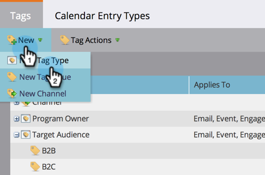
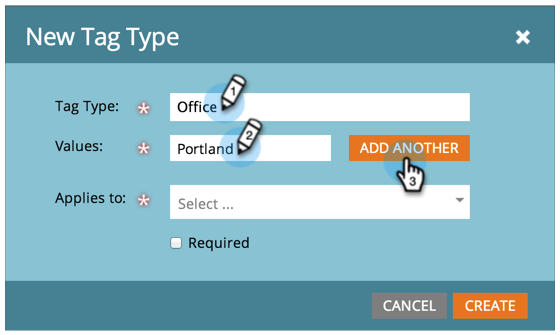

# 新建项目标记和标记值{#create-a-new-program-tag-and-tag-values}

>[!NOTE]
>
>**需要管理权限**

您可以为项目创建自定义[标签](/help/marketo/product-docs/core-marketo-concepts/programs/working-with-programs/understanding-tags.md)并为标签赋值。

>[!NOTE]
>
>**示例**
>
>项目标记：目标受众
>
>项目标记值：中小型企业、企业、中端市场

1. 在&#x200B;**Admin**&#x200B;下，单击&#x200B;**标记**。

   

1. 单击&#x200B;**新建**，然后选择&#x200B;**新建标记类型**。

   

1. 输入&#x200B;**标记类型**&#x200B;和标记&#x200B;**值**。 然后，单击&#x200B;**添加其他**。

   

1. 输入所需数量的值。 选择要应用此标签的项目类型。

   

   >[!TIP]
   >
   >您可以选择多个项目类型。 创建新项目后，此标记类型将可用。

1. 选中&#x200B;**必需**，然后单击&#x200B;**创建**。

   

   >[!NOTE]
   >
   >如果标记类型为&#x200B;**Required**，则用户在创建新项目时需要输入标记值。

   

现在，当您的用户创建项目时，他们必须为创建的标记设置自定义值。
