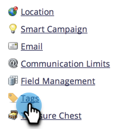
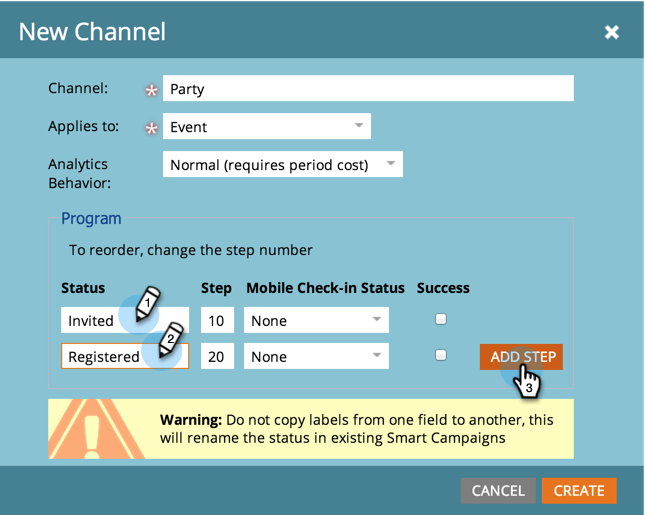

# 创建项目群渠道 {#create-a-program-channel}

项目是一个特定的营销计划。 该渠道旨在作为投放机制，例如网络研讨会、赞助或在线广告。

>[!NOTE]
>
>**需要管理员权限**

>[!NOTE]
>
>详细了解 [程序](/help/marketo/product-docs/core-marketo-concepts/programs/creating-programs/understanding-programs.md)是Marketo中最重要的元素。

1. 转到 **[!UICONTROL 管理员]** 区域。

   

1. 单击 **[!UICONTROL 标记]**.

   

   >[!NOTE]
   >
   >为什么标记？ 与其他标记一样，渠道是描述节目的一种方式。 这个频道有特殊的额外功能。

1. 单击 **+** 旁边签名 [!UICONTROL 渠道] 以展开并查看现有渠道。

   

1. 下 **[!UICONTROL 新]**，单击 **[!UICONTROL 新建渠道]**.

   

   >[!NOTE]
   >
   >**示例**
   >
   >频道：广告牌
   >
   >* 应用到：默认
   >* 晋升：成员、参与（如有疑问，这些工作正常）
   >* 成功：已参与
   >
   >渠道：参与方
   >
   >* 应用到：事件
   >* 进度：已邀请、已注册、无节目和已参加
   >* 成功：已参加
   >
   >查看现有渠道的进度以了解如何使用它们。

1. 让我们以“聚会”渠道为例。 命名您的新名称 **渠道** 并选择要应用它的程序类型。

   

   >[!NOTE]
   >
   >应用于什么？ 有几种类型的程序。 将渠道与正确的类型匹配。 如有疑问，请选择 **[!UICONTROL 默认]**.

   >[!NOTE]
   >
   >使用&quot;[!UICONTROL 网络研讨会活动]，“ ”系统映射将被锁定（根据网络研讨会集成的要求）并且无法编辑。

1. 输入前两个程序状态名称，然后单击 **[!UICONTROL 添加步骤]**.

   

1. 输入其他程序 **[!UICONTROL 状态]** 和 **[!UICONTROL 步骤]** 编号，然后单击 **[!UICONTROL 添加步骤]**.

   

   >[!TIP]
   >
   >此 **[!UICONTROL 步骤]** 编号用于对程序状态进行排序。 请记住，人们不能在这些进步的步骤中后退。 它们只能将状态更改为更高值或等值的状态。 当状态要来回切换而不是进程时，请使用相等值。

1. 输入最后一个项目 **[!UICONTROL 状态]** 和 **[!UICONTROL 步骤]** 数字。

   

   >[!NOTE]
   >
   >使用类型&#39;&#39;时[!UICONTROL 事件]、”系统映射“已注册”、“轮候”和“已参加”状态是必需的。 因此，无法隐藏这些状态。

1. 选取 **[!UICONTROL 移动设备签入状态]** 对象 **[!UICONTROL 已注册]**.

   

1. 选取 **[!UICONTROL 移动设备签入状态]** 对象 **[!UICONTROL 已参加]**.

   

   >[!NOTE]
   >
   >**[!UICONTROL 移动设备签入状态]** 仅当渠道适用于活动项目时，选项才可用。

   >[!NOTE]
   >
   >仅限拥有以下权限的人员： **[!UICONTROL 移动设备签入状态]** 之 **[!UICONTROL 已注册]** 和 **[!UICONTROL 已参加]** 将显示在 [移动设备签入应用程序](/help/marketo/product-docs/core-marketo-concepts/mobile-apps/event-check-in/event-check-in-overview.md).

   >[!TIP]
   >
   >如果在移动设备登记应用程序中创建了新人员，则该人员将在事件程序中设置为“已注册”。 如果人员登记了应用程序中的事件，则该人员将在事件程序中设置为已参加。

1. 选择 **[!UICONTROL 成功]** 项目状态，然后单击 **[!UICONTROL 创建]**.

   

   做得好！ 当您制作该类型的新节目时，此新频道将是选项之一。
