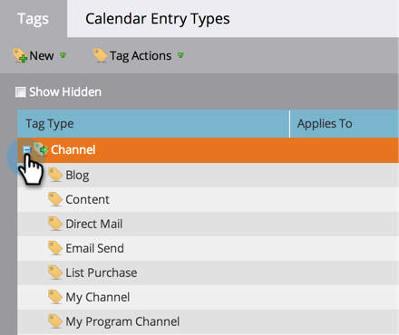
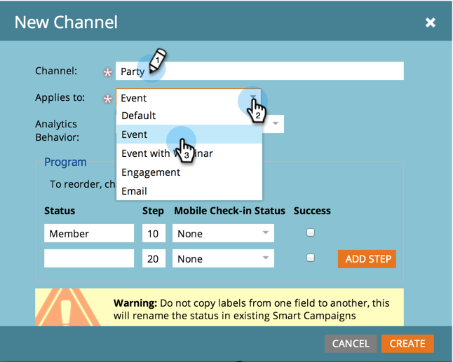
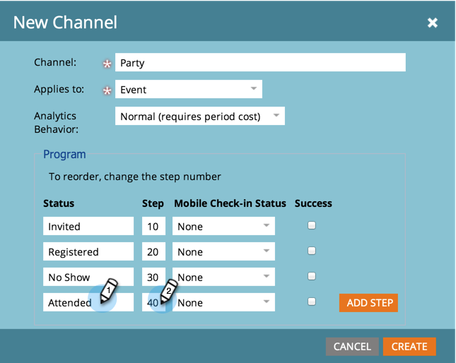

# 创建项目渠道 {#create-a-program-channel}

项目是一项特定的营销计划。 渠道旨在作为投放机制，例如网络研讨会、赞助或在线广告。

>[!NOTE]
>
>**需要管理员权限**

>[!NOTE]
>
>了解有关Marketo中最重要的元素[程序](/help/marketo/product-docs/core-marketo-concepts/programs/creating-programs/understanding-programs.md)的更多信息。

1. 进入 **[!UICONTROL Admin]** 区域。

   

1. 单击 **[!UICONTROL Tags]**。

   

   >[!NOTE]
   >
   >为什么要添加标记？ 频道是描述节目的一种方式，与其他标记类似。 该渠道具有特殊的额外功能。

1. 单击[!UICONTROL Channel]旁边的&#x200B;**+**&#x200B;符号展开并查看现有渠道。

   

1. 在&#x200B;**[!UICONTROL New]**&#x200B;下，单击&#x200B;**[!UICONTROL New Channel]**。

   

   >[!NOTE]
   >
   >**示例**
   >
   >频道：公告牌
   >
   >* 应用到：默认
   >* 晋升：成员、参与（这些是适当的默认值）
   >* 成功：已参与
   >
   >渠道：参与方
   >
   >* 应用到：事件
   >* 进度：已邀请、已注册、无节目和已参加
   >* 成功：已参加
   >
   >查看现有渠道的进展情况，以获取有关如何使用这些渠道的指导。

1. 以参与方渠道为例，命名您的新&#x200B;**[!UICONTROL Channel]**&#x200B;并选择它将应用到的节目类型。

   

   >[!NOTE]
   >
   >有几种类型的程序。 将渠道与正确的类型匹配。 如果不确定，请选择&#x200B;**[!UICONTROL Default]**。

   >[!NOTE]
   >
   >使用“[!UICONTROL Event with Webinar]”时，系统映射将被锁定（根据网络研讨会集成的要求）且无法编辑。

1. 输入前两个程序状态名称，然后单击&#x200B;**[!UICONTROL Add Step]**。

   

1. 输入其他节目&#x200B;**[!UICONTROL Status]**&#x200B;和&#x200B;**[!UICONTROL Step]**&#x200B;编号，然后单击&#x200B;**[!UICONTROL Add Step]**。

   

   >[!TIP]
   >
   >**[!UICONTROL Step]**&#x200B;编号用于排序程序状态。 请注意，人们不能在这些进展步骤中后退。 它们只能将状态更改为更高或等值的状态。 当状态要来回切换而不是按级数切换时，请使用相等值。

1. 输入最后一个节目&#x200B;**[!UICONTROL Status]**&#x200B;和&#x200B;**[!UICONTROL Step]**&#x200B;编号。

   

   >[!NOTE]
   >
   >使用类型“[!UICONTROL Event]”时，需要系统映射“已注册”、“轮候”和“已参加”状态。 因此，无法隐藏这些状态。

1. 为&#x200B;**[!UICONTROL Registered]**&#x200B;选择&#x200B;**[!UICONTROL Mobile Check-in Status]**。

   

1. 为&#x200B;**[!UICONTROL Attended]**&#x200B;选择&#x200B;**[!UICONTROL Mobile Check-in Status]**。

   

   >[!NOTE]
   >
   >**[!UICONTROL Mobile Check-in Status]**&#x200B;选项仅在渠道适用于事件项目时才可用。

   >[!NOTE]
   >
   >只有拥有&#x200B;**[!UICONTROL Registered]**&#x200B;和&#x200B;**[!UICONTROL Attended]**&#x200B;的&#x200B;**[!UICONTROL Mobile Check-in Status]**&#x200B;的用户才能在[移动设备签入应用](/help/marketo/product-docs/core-marketo-concepts/mobile-apps/event-check-in/event-check-in-overview.md)中可见。

   >[!TIP]
   >
   >如果在移动设备签入应用中创建了新人员，则事件程序中将它设置为[!UICONTROL Registered]。 如果某人已登记到应用程序上的事件，则事件程序中的该人将被设置为[!UICONTROL Attended]。

1. 选择&#x200B;**[!UICONTROL Success]**&#x200B;程序状态，然后单击&#x200B;**[!UICONTROL Create]**。

   

   当您制作该类型的新节目时，此新频道将是选项之一。
