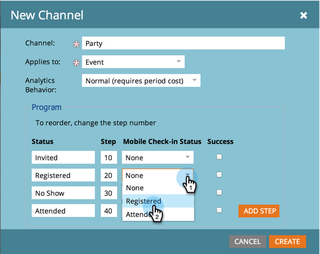

# 创建节目渠道 {#create-a-program-channel}

计划是一项特定的营销计划。 该渠道旨在成为交付机制，如网络研讨会、赞助或在线广告。

>[!NOTE]
>
>**需要管理员权限**

>[!NOTE]
>
>详细了解 [项目](/help/marketo/product-docs/core-marketo-concepts/programs/creating-programs/understanding-programs.md),Marketo中最重要的元素。

1. 转到 **管理员** 的上界。

   

1. 单击 **标记**.

   

   >[!NOTE]
   >
   >为什么要标记？ 渠道是一种描述项目的方式，与其他标记一样。 该频道仅提供特殊的额外功能。

1. 单击 **+** 在下面 **渠道** 以展开和查看现有渠道。

   

1. 在 **新建**，单击 **新渠道**.

   

   >[!NOTE]
   >
   >**示例**
   >
   >渠道：公告牌
   >
   >* 适用于：默认
   >* 进展：成员，已聘用（如有疑问，这些工作正常）
   >* 成功：已参与

   >
   >渠道：交易方
   >
   >* 适用于：事件
   >* 进展：已邀请、已注册、无节目且已出席
   >* 成功：已出席

   >
   >查看现有渠道的进度，了解如何使用这些渠道。

1. 让我们来看党频道示例。 命名新 **渠道** 并选择要应用的程序类型。

   

   >[!NOTE]
   >
   >申请什么？ 程序有几种类型。 将渠道与正确类型匹配。 如有疑问，请选择 **默认**.

   >[!NOTE]
   >
   >使用“包含网络研讨会的事件”时，系统映射将被锁定（网络研讨会集成所需）且无法编辑。

1. 输入前两个程序的状态名称，然后单击 **添加步骤**.

   

1. 输入其他程序 **状态** 和 **步骤** 数字，然后单击 **添加步骤**.

   

   >[!TIP]
   >
   >的 **步骤** 编号用于对程序状态进行排序。 请记住，在这些进度步骤中，人们不能向后进行。 它们只能将状态更改为较高值或等值状态。 当状态要进行来回切换而不是前进时，请使用相等的值。

1. 输入最后一个程序 **状态** 和 **步骤** 数字。

   

   >[!NOTE]
   >
   >使用类型“Event”时，需要映射“已注册”、“已列出等待”和“已出席”状态的系统。 因此，无法隐藏这些状态。

1. 选择 **移动设备签入状态** 表示 **已注册**.

   

1. 选择 **移动设备签入状态** 表示 **已出席**.

   

   >[!NOTE]
   >
   >**移动设备签入状态**** **选项仅在渠道将用于事件程序时才可用。

   >[!NOTE]
   >
   >只有具有 **移动设备签入状态** of **已注册** 和 **已出席** 将在 [移动设备签入应用程序](/help/marketo/product-docs/core-marketo-concepts/mobile-apps/event-check-in/event-check-in-overview.md).

   >[!TIP]
   >
   >如果在移动签入应用程序中创建了新人员，则会在事件程序中将其设置为已注册。 如果某个人被签入应用程序上的事件，则该事件将在事件程序中设置为已出席。

1. 选择 **成功** 程序状态，然后单击 **创建**.

   

   干得好！ 当您制作此类型的新程序时，将选择此新渠道。
