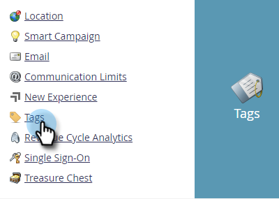

# 创建自定义标记 {#create-custom-tags}

标记将帮助您组织程序，而渠道将帮助您收集数据以用于报告。

>[!NOTE]
>
>签出 [了解标记](/help/marketo/product-docs/core-marketo-concepts/programs/working-with-programs/understanding-tags.md) 了解更多信息。

>[!NOTE]
>
>**需要管理员权限**

## 创建新标记类型 {#create-a-new-tag-type}

要创建新标记类型，请执行以下操作：

1. 转到 **[!UICONTROL 管理员]** 部分。

   

1. 单击 **[!UICONTROL 标记]**.

   

1. 单击 **[!UICONTROL 新]** 并选择 **[!UICONTROL 新标记类型]**.

   

1. 输入标记类型的名称。

   

1. 为标签类型输入所需的值。 单击 **[!UICONTROL 添加其他]** 以输入附加值。

   

1. 选择此标记适用的程序类型。

   

1. 确定是否使此标记对于列出的所有程序类型都是必需的。

   

   >[!NOTE]
   >
   >* 选择“[!UICONTROL 必需]”如果您希望随时创建新项目时添加此标记。
   >* 从“ ”中删除程序类型[!UICONTROL 应用于]”列表将从该类型的所有现有程序中删除标记及其值。 如果要保留现有标记值，并将此标记设置为可选标记，则可以 _所有_ 列出程序类型，将“必需”复选框保留为未选中状态。

   >[!TIP]
   >
   >如果要使类似的标记对于某些程序类型是必需的，但对于其他程序类型是可选的，您需要设置两个单独的标记，每个标记应用于不同的程序类型，一个带有“[!UICONTROL 必需]已选中，而另一个具有“[!UICONTROL 必需]未选择&#39;&#39;。

1. 单击&#x200B;**[!UICONTROL 创建]**。

   
