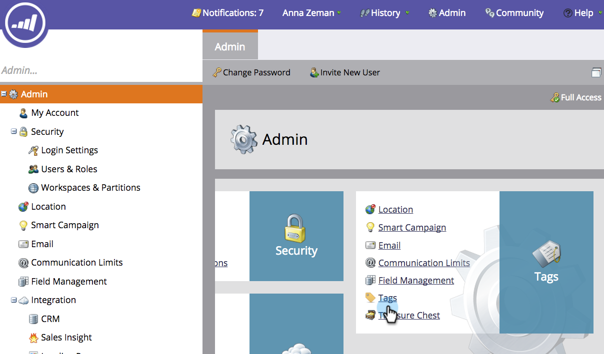
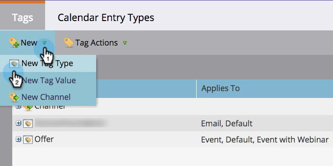
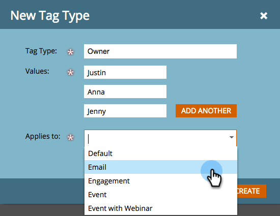

# 创建自定义标记{#create-custom-tags}

标记将帮助您组织项目，而渠道将协助收集数据以用于报告。

>[!NOTE]
>
>**深潜**
>
>有关详细信息，请参阅[了解标记](../../../product-docs/core-marketo-concepts/programs/working-with-programs/understanding-tags.md)。

>[!NOTE]
>
>**需要管理员权限**

## 创建新标记类型{#create-a-new-tag-type}

要创建新标记类型，请执行以下操作：

1. 转至&#x200B;**Admin**&#x200B;部分。

   

1. 单击&#x200B;**标记**。

   

1. 单击&#x200B;**新建**&#x200B;并选择&#x200B;**新建标记类型。**

   

1. 输入&#x200B;**标记类型**&#x200B;的名称。

   

1. 为标记类型输入所需的&#x200B;**值**。 单击&#x200B;**添加其他**&#x200B;以输入其他标记值。

   

1. 选择此标记应用于的项目类型。

   

   >[!NOTE]
   >
   >选择“所有项目都需要&#x200B;**”，以在任何新项目创建时添加此标记。**

1. 单击&#x200B;**创建**&#x200B;以保存。

   

   就这样！ 现在，您可以为项目创建自定义标记。
