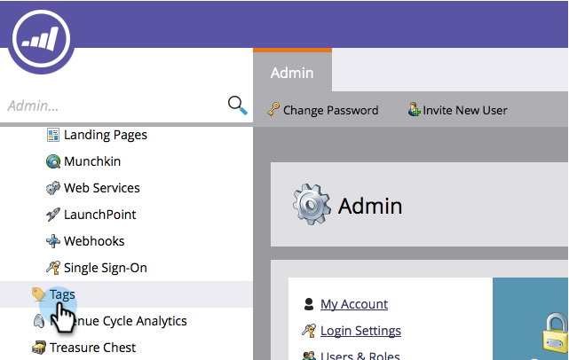

# 从项目渠道{#delete-a-program-status-from-a-program-channel}中删除项目状态

项目状态是通过项目路径(渠道)检查点。 如果您错误地创建了状态或不再需要它，请随意删除它。

1. 转至&#x200B;**Admin**&#x200B;部分。

   

1. 单击&#x200B;**标记**。

   

1. 选择要从中删除状态的渠道，然后在&#x200B;**标记操作**&#x200B;下，单击&#x200B;**编辑**。

   

1. 单击删除状态，然后单击&#x200B;**保存**。

   >[!TIP]
   >
   >如果当前已将任何人分配到有关状态，则无法删除该状态，但可以隐藏它。

   

干得好！ 如果需要，还可以[删除整个渠道](/help/marketo/product-docs/administration/tags/delete-a-program-channel.md)。
