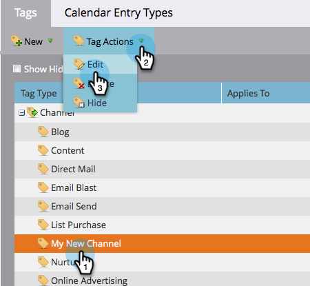

# 从节目渠道中删除节目状态 {#delete-a-program-status-from-a-program-channel}

程序状态是通过程序路径（渠道）检查点。 如果您错误地设置了状态或不再需要它，请随时将其删除。

1. 转到 **管理员** 的上界。

   

1. 单击 **标记**.

   

1. 选择要从中删除状态的渠道，然后在 **标记操作**，单击 **编辑**.

   

1. 单击红色 **X** 要删除状态，请单击 **保存**.

   

   >[!TIP]
   >
   >如果当前有人被分配到相关状态，则无法删除该状态，但可以隐藏该状态。

干得好！ 您还可以 [删除整个渠道](/help/marketo/product-docs/administration/tags/delete-a-program-channel.md) 如果你需要的话。
