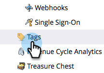

# 从项目渠道中删除项目状态 {#delete-a-program-status-from-a-program-channel}

程序状态是通过程序路径（渠道）的检查点。 如果您错误地设置了一个状态或不再需要该状态，可以将其删除。

1. 进入 **[!UICONTROL Admin]** 区域。

   

1. 单击 **[!UICONTROL Tags]**。

   

1. 选择要从中删除状态的频道，然后在&#x200B;**[!UICONTROL Tag Actions]**&#x200B;下单击&#x200B;**[!UICONTROL Edit]**。

   

1. 单击红色的&#x200B;**X**&#x200B;以删除状态，然后单击&#x200B;**[!UICONTROL Save]**。

   

   >[!TIP]
   >
   >如果有任何人员当前被分配到相关状态，则不能将其删除，但可以隐藏该状态。

如果需要，您还可以[删除整个渠道](/help/marketo/product-docs/administration/tags/delete-a-program-channel.md)。
