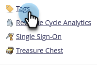
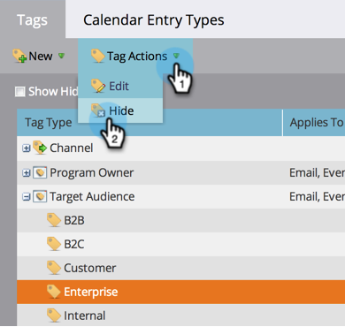

# 管理标记值 {#managing-tag-values}

[标记](/help/marketo/product-docs/core-marketo-concepts/programs/working-with-programs/understanding-tags.md) 用于描述程序。 您可以根据需要创建任意数量的变量，每个变量的值都是唯一的。 下面是如何管理这些值。

>[!NOTE]
>
>**需要管理员权限**

>[!PREREQUISITES]
>
>[创建新程序标记和标记值](/help/marketo/product-docs/administration/tags/create-a-new-program-tag-and-tag-values.md)

## 添加标记值 {#adding-tag-values}

1. 转到 **管理员** 的上界。

   

1. 单击 **标记**.

   

1. 单击 **新建**，则 **新标记值**.

   

1. 选择 **标记类型**.

   

1. 输入 **值** 单击 **添加其他**. 您可以根据需要添加任意数量的值。

   

1. 添加其余值并单击 **创建**.

   

1. 您应会立即看到更改！

   

## 隐藏标记值 {#hiding-tag-values}

旧程序可能会使用标记。 您可以通过隐藏标记类型来弃用它们以供将来使用。

1. 选择 **标记** ，然后选择 **值** 你想藏起来。

   

1. 在 **标记操作**，选择 **隐藏**.

   

## 显示隐藏值 {#show-hidden-values}

如果要再次查看隐藏值，请执行以下操作：

1. 选择显示隐藏框。 选中后，您可以看到隐藏值。

   

然后，您可以取消隐藏将来要使用的值。
