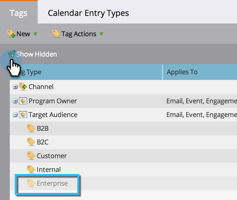

# 管理标记值 {#managing-tag-values}

[标签](../../../product-docs/core-marketo-concepts/programs/working-with-programs/understanding-tags.md) 用于描述项目。 您可以根据需要制作任意数量的图像，每个图像都具有唯一的值。 下面介绍如何管理这些价值。

>[!NOTE]
>
>**需要管理员权限**

>[!NOTE]
>
>**先决条件**
>
>[创建新项目标记和标记值](create-a-new-program-tag-and-tag-values.md)

## 添加标记值 {#adding-tag-values}

1. 在“管 **理员**”下，单 **击“标记**”。

   

1. 依次单击**新建**、新 **建标记值**。

   

1. 选择标 **记类型**。

   

1. 输入值 **，然** 后单击 **添加其他**。 您可以添加任意所需数量的值。

   

1. 添加其余值，然后单击“ **创建**”。

   

1. 您应立即看到更改！

## 隐藏标记值 {#hiding-tag-values}

旧项目可能使用标记。 您可以通过隐藏标记类型来弃用它们以供将来使用。

1. 选择** **标&#x200B;**签** ，然后 **选择要隐** 藏的“值”。

   

1. 在“标 **记操作**”下，选 **择“隐藏**”。

   

## 显示隐藏值 {#show-hidden-values}

如果要再次查看隐藏值，请执行以下操作：

1. 选择显示隐藏框。 选中后，您可以看到隐藏值。

   

   然后，您可以取消隐藏将来要使用的值。

