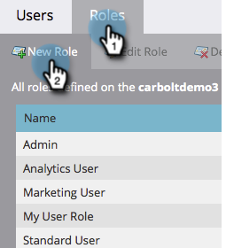

# 创建仅API用户角色 {#create-an-api-only-user-role}

如果您想要通过 [REST API](https://developers.marketo.com/documentation/rest/)，最佳实践是 [为用户分配“仅限API”角色](/help/marketo/product-docs/administration/users-and-roles/create-an-api-only-user.md) 然后 [创建用于ReST API的自定义服务](/help/marketo/product-docs/administration/additional-integrations/create-a-custom-service-for-use-with-rest-api.md). 以下是如何创建仅API用户角色。

>[!NOTE]
>
>**需要管理员权限**

1. 转到 **管理员** 的上界。

   

1. 单击 **用户和角色**.

   

1. 单击 **角色** 选项卡，然后 **新角色**.

   

1. 输入角色名称，选择您要授予的API访问权限，然后单击 **创建。**

   

>[!TIP]
>
>最好只授予所需的最低权限。

>[!MORELIKETHIS]
>
>好，干得好！ 现在，让我们 [创建仅限API的用户](/help/marketo/product-docs/administration/users-and-roles/create-an-api-only-user.md).
