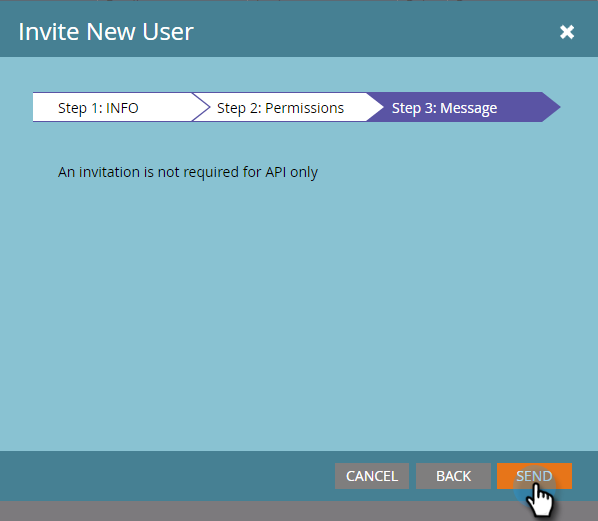

# 创建仅API用户 {#create-an-api-only-user}

Marketo如果您要通过 [REST API](https://developers.marketo.com/documentation/rest/){target="_blank"}，您将需要创建仅API用户。 下面是具体操作方法。

>[!PREREQUISITES]
>
>[创建仅API用户角色](/help/marketo/product-docs/administration/users-and-roles/create-an-api-only-user-role.md){target="_blank"}

>[!NOTE]
>
>**需要管理员权限**

1. 转到 **[!UICONTROL 管理员]** 区域。

   

1. 单击 **[!UICONTROL 用户和角色]**.

   

1. 单击 **[!UICONTROL 邀请新用户]**.

   

1. 为仅API用户输入电子邮件、名字和姓氏。 单击 **[!UICONTROL 下一个]**.

   

   >[!TIP]
   >
   >添加可选原因或访问到期日期。 对于短期员工，访问过期日期很方便。

1. 选择 **[!UICONTROL 仅API]** 角色并检查 **[!UICONTROL 仅API]** 复选框。 单击 **[!UICONTROL 下一个]**.

   

1. 单击 **[!UICONTROL 发送]**.

   

>[!NOTE]
>
>弹出窗口显示，“不仅API需要邀请”，但这并不意味着您犯了错误。 这仅意味着我们将创建角色，而无需发送邀请电子邮件。

那就好！ 现在，让我们继续创建自定义服务。

>[!MORELIKETHIS]
>
>[创建用于ReST API的自定义服务](/help/marketo/product-docs/administration/additional-integrations/create-a-custom-service-for-use-with-rest-api.md){target="_blank"}
