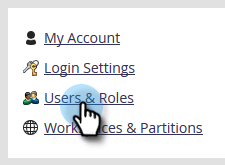

# 仅创建API用户 {#create-an-api-only-user}

如果您想要通过 [REST API](https://developers.marketo.com/documentation/rest/)，则需要创建仅API用户。 这是方法。

>[!PREREQUISITES]
>
>[创建仅API用户角色](/help/marketo/product-docs/administration/users-and-roles/create-an-api-only-user-role.md)

>[!NOTE]
>
>**需要管理员权限**

1. 转到 **管理员** 的上界。

   

1. 单击 **用户和角色**.

   

1. 单击 **邀请新用户**.

   

1. 为仅API用户输入电子邮件、名字和姓氏。 单击 **下一个**.

   

   >[!TIP]
   >
   >添加可选原因或访问过期日期。 对于短期员工而言，访问过期日期会很方便。

1. 选择 **仅限API** 角色并检查 **仅限API** 复选框。 单击 **下一个**.

   

1. 单击 **发送**.

   

>[!NOTE]
>
>弹出窗口显示：“邀请不是仅API所必需的，”但这并不意味着您做了错事。 这只意味着我们将创建角色，而无需发送邀请电子邮件。

那好吧！ 现在，让我们继续创建自定义服务。

>[!MORELIKETHIS]
>
>[创建用于ReST API的自定义服务](/help/marketo/product-docs/administration/additional-integrations/create-a-custom-service-for-use-with-rest-api.md)
