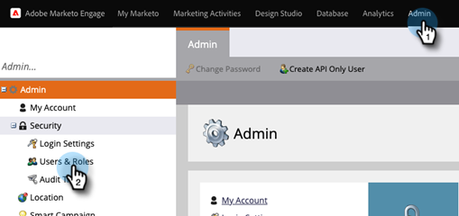

# 为启用 Adobe IMS 的订阅添加仅限 API 用户 {#add-api-only-user-for-adobe-ims-enabled-subscriptions}

虽然Marketo Engage营销用户和管理员在Adobe Admin Console中进行管理，但必须在Marketo Engage中创建和管理仅Marketo Engage API用户。

以下步骤描述了如何在Marketo Engage中添加仅API用户。 在执行此操作之前，必须[已建立仅API角色](/help/marketo/product-docs/administration/users-and-roles/create-an-api-only-user-role.md)。

1. 在Marketo中，单击&#x200B;**[!UICONTROL Admin]**&#x200B;并选择&#x200B;**[!UICONTROL Users & Roles]**。

   

1. 单击 **[!UICONTROL Create API Only User]**。

   

1. 为仅API用户输入[!UICONTROL Email]、[!UICONTROL First Name]和[!UICONTROL Last Name]。 选择要分配给用户的[!UICONTROL API Only]角色。 完成后，单击 **[!UICONTROL Create API Only User]**。

   

>[!NOTE]
>
>当操作成功时，仅API用户创建模式将关闭，用户列表将刷新，并且新用户将可见。
