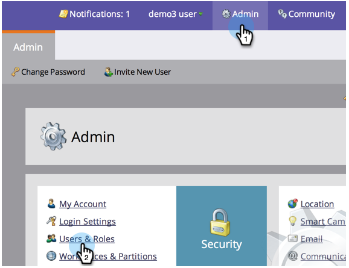

# 创建、删除、编辑和更改用户角色{#create-delete-edit-and-change-a-user-role}

**角** 色将许多权限组合。**允** 许您在Marketo做事。您将&#x200B;**角色**&#x200B;分配给用户。 象派一样简单。

>[!NOTE]
>
>**需要管理权限**

## 创建角色{#create-a-role}

1. 转至&#x200B;**Admin**&#x200B;并单击&#x200B;**用户和角色**。

   

1. 转到&#x200B;**角色选项卡**，然后单击&#x200B;**新建角色**。

   

1. 命名新角色，检查您要授予与该角色关联的用户的所有权限，然后单击&#x200B;**创建**。

   

## 删除角色{#delete-a-role}

1. 在&#x200B;**Admin**&#x200B;下，单击&#x200B;**用户和角色**。

   

1. 在&#x200B;**角色**&#x200B;选项卡下，选择角色，然后单击&#x200B;**删除角色**。

   

1. 单击&#x200B;**删除**&#x200B;以确认删除。

   

>[!NOTE]
>
>您必须首先确保没有为任何用户分配角色，否则无法删除该角色。

## 编辑现有角色{#edit-an-existing-role}

>[!NOTE]
>
>要编辑您自己的用户角色，您必须以具有管理员权限的其他用户身份登录。

1. 转至&#x200B;**Admin**&#x200B;并单击&#x200B;**用户和角色**。

   

1. 单击&#x200B;**角色**&#x200B;选项卡。

   

1. 选择要编辑的角色，然后单击&#x200B;**编辑角色**。

   

1. 进行所需的所有更改，然后单击&#x200B;**保存**。

   

   >[!NOTE]
   >
   >对角色所做的更改将影响与此角色关联的每个用户。

   >[!TIP]
   >
   >您是否正在更新帐户电子邮件地址？ [了解详情](/help/marketo/product-docs/administration/settings/edit-account-settings.md)。

## 更改用户角色{#change-a-users-role}

1. 转至&#x200B;**Admin**&#x200B;并单击&#x200B;**用户和角色**。

   

1. 选择要向其分配其他角色的用户，然后单击&#x200B;**编辑用户。**

   

1. 取消选中上一个角色，选择新角色，然后单击&#x200B;**保存**。

   

>[!NOTE]
>
>如果您选择了多个角色，Marketo将默认使用限制最严格的权限。
