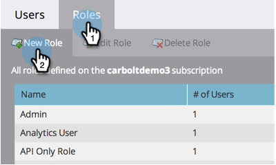
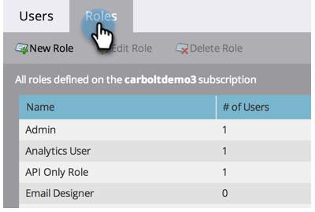

# 创建、删除、编辑和更改用户角色 {#create-delete-edit-and-change-a-user-role}

**角色**&#x200B;将一组权限组合在一起。 **权限**&#x200B;允许您在Marketo中执行操作。 您将&#x200B;**角色**&#x200B;分配给用户。

>[!NOTE]
>
>**需要管理员权限**

>[!IMPORTANT]
>
>以下角色是系统角色，无法删除：
>
>* 管理员
>* Adobe产品管理员

## 创建角色 {#create-a-role}

1. 进入 **[!UICONTROL Admin]** 区域。

   

1. 单击 **[!UICONTROL Users & Roles]**。

   

1. 转到&#x200B;**[!UICONTROL Roles]**&#x200B;选项卡并单击&#x200B;**[!UICONTROL New Role]**。

   

1. 命名新角色，选中要授予与该角色关联的用户的所有权限，然后单击&#x200B;**[!UICONTROL Create]**。

   

## 删除角色 {#delete-a-role}

1. 进入 **[!UICONTROL Admin]** 区域。

   

1. 单击 **[!UICONTROL Users & Roles]**。

   

1. 在&#x200B;**[!UICONTROL Roles]**&#x200B;选项卡下，选择一个角色并单击&#x200B;**[!UICONTROL Delete Role]**。

   

1. 单击&#x200B;**[!UICONTROL Delete]**&#x200B;确认删除。

   

>[!NOTE]
>
>您必须首先确保没有用户被分配给某个角色，否则无法删除该角色。

## 编辑现有角色 {#edit-an-existing-role}

>[!NOTE]
>
>要编辑您自己的用户角色，您必须以具有管理员权限的其他用户身份登录。

1. 进入 **[!UICONTROL Admin]** 区域。

   

1. 单击 **[!UICONTROL Users & Roles]**。

   

1. 单击 **[!UICONTROL Roles]** 选项卡。

   

1. 选择要编辑的角色并单击&#x200B;**[!UICONTROL Edit Role]**。

   

1. 进行所需的所有更改，然后单击&#x200B;**[!UICONTROL Save]**。

   

   >[!NOTE]
   >
   >对角色所做的更改将影响与此角色关联的每个用户。

## 更改用户的角色 {#change-a-users-role}

1. 进入 **[!UICONTROL Admin]** 区域。

   

1. 单击 **[!UICONTROL Users & Roles]**。

   

1. 选择要为其分配其他角色的用户，然后单击&#x200B;**[!UICONTROL Edit User]**。

   

1. 取消选中上一个角色，选择新角色，然后单击&#x200B;**[!UICONTROL Save]**。

   

>[!NOTE]
>
>如果您保留选中多个角色，则Marketo将默认使用限制最严格的权限。
