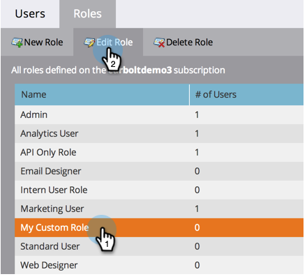

# 创建、删除、编辑和更改用户角色 {#create-delete-edit-and-change-a-user-role}

**角色** 分组一组权限。 **权限** 允许你在Marketo做事。 您为 **角色** 用户。 放松点。

>[!NOTE]
>
>**需要管理员权限**

>[!IMPORTANT]
>
>以下角色是系统角色，无法编辑或删除：
>
>* 管理员
>* Adobe产品管理员
>* 标准用户
>* RTP编辑器
>* RTP启动器

## 创建角色 {#create-a-role}

1. 转到 **管理员** 的上界。

   

1. 单击 **用户和角色**.

   

1. 转到 **“角色”选项卡** 单击 **新角色**.

   

1. 命名新角色，检查您要授予与该角色关联的用户的所有权限，然后单击 **创建**.

   

## 删除角色 {#delete-a-role}

1. 转到 **管理员** 的上界。

   

1. 单击 **用户和角色**.

   

1. 在 **角色** 选项卡，选择角色并单击 **删除角色**.

   

1. 通过单击 **删除**.

   

>[!NOTE]
>
>您必须首先确保未向任何用户分配角色，否则将无法删除该角色。

## 编辑现有角色 {#edit-an-existing-role}

>[!NOTE]
>
>要编辑您自己的用户角色，您必须以具有管理员权限的其他用户身份登录。

1. 转到 **管理员** 的上界。

   

1. 单击 **用户和角色**.

   

1. 单击 **角色** 选项卡。

   

1. 选择要编辑的角色，然后单击 **编辑角色**.

   

1. 进行所有所需的更改并单击 **保存**.

   

   >[!NOTE]
   >
   >对角色所做的更改将影响与此角色关联的每个用户。

   >[!TIP]
   >
   >是否要更新帐户电子邮件地址？ [了解此处](/help/marketo/product-docs/administration/settings/edit-account-settings.md).

## 更改用户角色 {#change-a-users-role}

1. 转到 **管理员** 的上界。

   

1. 单击 **用户和角色**.

   

1. 选择要为其分配其他角色的用户，然后单击 **编辑用户。**

   

1. 取消选中前一个角色，选择新角色，然后单击 **保存**.

   

>[!NOTE]
>
>如果保留选定的多个角色，Marketo将默认使用最受限的权限。
