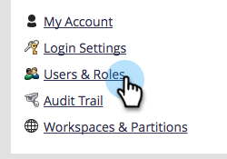

# 为代码片段启用无草稿 {#enable-no-draft-for-snippets}

无草稿代码片段允许您分发代码片段更改，而无需使用它来起草已批准的资源。 所有使用已编辑代码片段的资源都会获取更新并保持其各自的状态：

* 批准资产会获取代码片段更新并保持批准状态

* 草稿获取代码片段更新并保留在草稿模式

对于所有管理员角色，会自动启用“无草稿”。 然后，管理员可以为任何其他角色启用此功能。

>[!NOTE]
>
>**需要管理员权限**

1. 转到 **[!UICONTROL 管理员]** 区域。

   

1. 单击 **[!UICONTROL 用户和角色]**.

   

1. 转到 **[!UICONTROL 角色]** 选项卡，选择一个角色，然后单击 **[!UICONTROL 编辑角色]**.

   

1. 展开 **[!UICONTROL 访问Design Studio]** 选项。

   

1. 展开 **[!UICONTROL 访问代码片段]** 选项。

   

1. 展开 **[!UICONTROL 批准代码片段]** 权限并检查 **[!UICONTROL 无草稿]** 盒子。 然后单击 **[!UICONTROL 保存]**.

   

>[!TIP]
>
>要禁用“无草稿”，请按照上述步骤1-4操作，清除“无草稿”复选框，然后单击 **[!UICONTROL 保存]**.

>[!MORELIKETHIS]
>
>[批准带有非草稿的代码片段](/help/marketo/product-docs/personalization/segmentation-and-snippets/snippets/approve-a-snippet-with-no-draft.md){target="_blank"}
