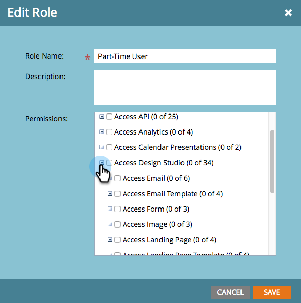

# 为代码片段启用无草稿 {#enable-no-draft-for-snippets}

无草稿代码片段允许您分发代码片段更改，而无需使用它来起草已批准的资源。 使用编辑后的代码片段的所有资源都会获取更新并保持其各自的状态：

* 批准的资产会获取代码片段更新并保持批准

* 草稿获取代码片段更新并保留在草稿模式

所有管理员角色会自动启用“无草稿”。 然后，管理员可以为任何其他角色启用此功能。

>[!NOTE]
>
>**需要管理员权限**

1. 转到 **管理员** 区域。

   

1. 单击 **用户和角色**.

   

1. 转到 **角色** 选项卡，选择一个角色，然后单击 **编辑角色**.

   

1. 展开 **访问Design Studio** 选项。

   

1. 展开 **访问代码片段** 选项。

   

1. 展开 **批准代码片段** 权限并检查 **无草稿** 盒子。 然后单击 **保存**.

   

>[!TIP]
>
>要禁用“无草稿”，请按照上述步骤1-4操作，清除“无草稿”复选框，然后单击 **保存**.

>[!MORELIKETHIS]
>
>[批准带有无草稿的代码片段](/help/marketo/product-docs/personalization/segmentation-and-snippets/snippets/approve-a-snippet-with-no-draft.md)
