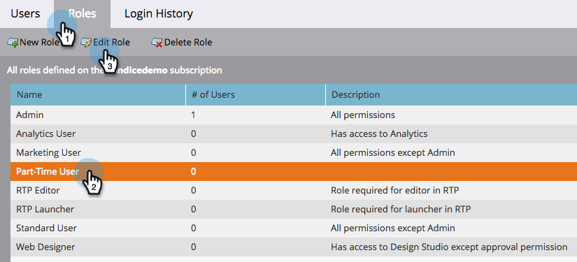

# 为代码片段启用无草稿 {#enable-no-draft-for-snippets}

无草稿代码片段允许您分发代码片段更改，而无需使用它来起草已批准的资源。 所有使用已编辑代码片段的资源都会获取更新并保持其各自的状态：

* 批准资产会获取代码片段更新并保持批准状态

* 草稿获取代码片段更新并保留在草稿模式

对于所有管理员角色，会自动启用“无草稿”。 然后，管理员可以为任何其他角色启用此功能。

>[!NOTE]
>
>**需要管理员权限**

1. 转到&#x200B;**[!UICONTROL 管理员]**&#x200B;区域。

   

1. 单击&#x200B;**[!UICONTROL 用户和角色]**。

   

1. 转到&#x200B;**[!UICONTROL 角色]**&#x200B;选项卡，选择一个角色，然后单击&#x200B;**[!UICONTROL 编辑角色]**。

   

1. 展开&#x200B;**[!UICONTROL Access Design Studio]**&#x200B;选项。

   

1. 展开&#x200B;**[!UICONTROL 访问代码片段]**&#x200B;选项。

   

1. 展开&#x200B;**[!UICONTROL Approve Snippet]**&#x200B;权限并选中&#x200B;**[!UICONTROL No-Draft]**&#x200B;框。 然后单击&#x200B;**[!UICONTROL 保存]**。

   

>[!TIP]
>
>要禁用无草稿，请按照上述步骤1-4操作，清除无草稿复选框，然后单击&#x200B;**[!UICONTROL 保存]**。

>[!MORELIKETHIS]
>
>[批准无草稿的代码片段](/help/marketo/product-docs/personalization/segmentation-and-snippets/snippets/approve-a-snippet-with-no-draft.md){target="_blank"}
