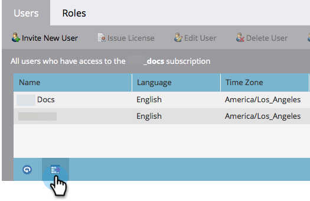

# 导出用户和角色列表 {#export-a-list-of-users-and-roles}

>[!NOTE]
>
>**需要管理员权限**

很容易导出用户和用户角色的完整列表。 这是方法。

1. 转到 **管理员**.

   

1. 单击 **用户和角色**.

   

1. 在导出之前，添加/删除您需要的任何列。

   >[!TIP]
   >
   >要导出角色，请转到 **角色** ，然后导出。

   

1. 单击 **导出** 图标。

   

   这就是所有人！ 您应该下载新的Excel文件。

   
