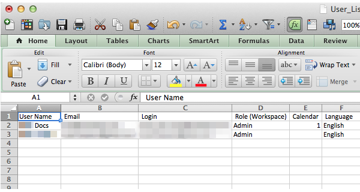

# 导出用户和角色列表 {#export-a-list-of-users-and-roles}

>[!NOTE]
>
>**需要管理员权限**

导出用户和用户角色的完整列表相当容易。 操作方法如下：

1. 转到&#x200B;**[!UICONTROL Admin]**。

   

1. 单击 **[!UICONTROL Users & Roles]**。

   

1. 在导出之前添加/删除任何所需的列。

   >[!TIP]
   >
   >要导出角色，请先转到&#x200B;**[!UICONTROL Roles]**&#x200B;选项卡，然后导出。

   

1. 单击&#x200B;**[!UICONTROL Export]**&#x200B;图标。

   

   仅此而已，伙计们！ 您应该正在下载新的Excel文件。

   
