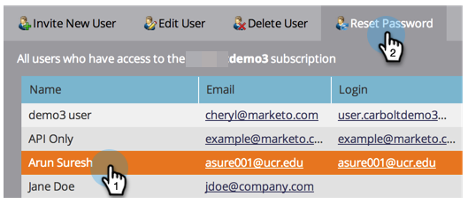

# 管理Marketo用户 {#managing-marketo-users}

## 创建用户 {#create-users}

1. 转到 **[!UICONTROL 管理员]** 区域。

   

1. 单击 **[!UICONTROL 用户和角色]**.

   

1. 单击 **[!UICONTROL 邀请新用户]**.

   

1. 输入 **[!UICONTROL 电子邮件]**， **[!UICONTROL 名字]**、和 **[!UICONTROL 姓氏]**.

   

1. （可选）输入邀请原因，并在 **[!UICONTROL 访问过期]** 使用日期选取器的字段。

   

1. 单击 **[!UICONTROL 下一个]**.

   

   >[!TIP]
   >
   >对于短期外部利益相关者或仅需要在短时间内访问Marketo的顾问而言，过期日期非常有用。

   >[!NOTE]
   >
   >到达到期日期时，用户会收到到期通知，并且其帐户将被锁定。

1. 选择 **[!UICONTROL 角色]** ，然后单击 **[!UICONTROL 下一个]**.

   

1. 如有必要，对邀请消息进行编辑。 单击 **send**.

   

   >[!NOTE]
   >
   >电子邮件/登录名必须是唯一的；如果您已在沙盒实例中使用过它，则需要在生产中使用其他电子邮件/登录名，反之亦然。

   

   >[!NOTE]
   >
   >邀请会在添加新用户后三天过期。

新用户现在列在“用户”选项卡中，并将收到一封电子邮件，其中包含有关如何激活其帐户的说明。

## 删除用户 {#delete-users}

1. 转到 **[!UICONTROL 管理员]** 区域。

   

1. 单击 **[!UICONTROL 用户和角色]**.

   

1. 选择要删除的用户并单击 **[!UICONTROL 删除用户]**.

   

1. 单击确认 **[!UICONTROL 确定]**.

   

## 重置用户密码 {#reset-user-passwords}

1. 转到 **[!UICONTROL 管理员]** 区域。

   

1. 单击 **[!UICONTROL 用户和角色]**.

   

1. 选择用户并单击 **[!UICONTROL 重置密码]**.

   

1. 单击 **[!UICONTROL 关闭]** 关闭提示。

   

用户将收到一封包含密码重置说明的电子邮件。

>[!TIP]
>
>如果用户在其收件箱中看不到该电子邮件，请要求他们检查其垃圾邮件/垃圾邮件文件夹。

## 更改权限和编辑用户信息 {#change-permissions-and-edit-user-information}

1. 转到 **[!UICONTROL 管理员]** 区域。

   

1. 单击 **[!UICONTROL 用户和角色]**.

   

1. 选择用户并单击 **[!UICONTROL 编辑用户]**.

   

1. 您可以编辑用户信息并更改关联的角色。 单击 **[!UICONTROL 保存]**.

   

>[!CAUTION]
>
>如果您是Marketo中的唯一管理员，请确保不要删除自己的管理员权限。

>[!NOTE]
>
>如果邀请新用户担任管理员，或者删除管理员，则所有当前管理员都将收到电子邮件通知。

做得很棒！ 您现在知道如何创建用户、删除用户、重置用户密码以及编辑用户。
