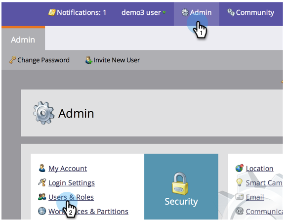

# 管理Marketo用户 {#managing-marketo-users}

## 创建用户 {#create-users}

1. 转到 **管理员** 单击 **用户和角色**.

   

1. 单击 **邀请新用户**.

   

1. 输入 **电子邮件地址**, **名字**&#x200B;和 **姓氏**.

   

1. （可选）输入邀请的原因，并在 **访问过期** 字段。

   

1. 单击 **下一个**.

   

   >[!TIP]
   >
   >对于只需要短暂访问Marketo的短期外部利益相关方或顾问而言，过期日期非常有用。

   >[!NOTE]
   >
   >到达过期日期后，用户会收到过期通知并锁定其帐户。

1. 选择 **角色** ，单击 **下一个**.

   

1. 根据需要对邀请消息进行编辑。 单击 **发送**.

   

   >[!NOTE]
   >
   >电子邮件/登录名必须是唯一的；如果您已在沙盒实例中使用它，则需要在生产中使用其他实例，反之亦然。

   

   >[!NOTE]
   >
   >添加新用户后三天，邀请即会过期。

新用户现在列在用户选项卡中，并将收到一封电子邮件，其中包含有关如何激活其帐户的说明。

## 删除用户 {#delete-users}

1. 转到“管理员”并单击 **用户和角色**.

   

1. 选择要删除的用户，然后单击 **删除用户**.

   

1. 单击以确认 **确定**.

   

## 重置用户密码 {#reset-user-passwords}

1. 转到“管理员”并单击 **用户和角色**.

   

1. 选择用户并单击 **重置密码**.

   

1. 单击 **关闭** 关闭提示。

   

用户将收到一封包含密码重置说明的电子邮件。

>[!TIP]
>
>如果用户在其收件箱中未看到电子邮件，请要求他们检查其垃圾邮件文件夹。

## 更改权限和编辑用户信息 {#change-permissions-and-edit-user-information}

1. 转到 **管理员** 单击 **用户和角色。**

   

1. 选择用户并单击 **编辑用户**.

   

1. 您可以编辑用户信息并更改关联的角色。 单击 **保存**.

   

>[!CAUTION]
>
>如果您是Marketo中的唯一管理员，请确保不要删除您自己的管理员权限。

>[!NOTE]
>
>如果作为管理员邀请了新用户，或者删除了管理员，则所有当前管理员都将收到电子邮件通知。

太棒了！ 您现在知道如何创建用户、删除用户、重置用户密码和编辑用户。
